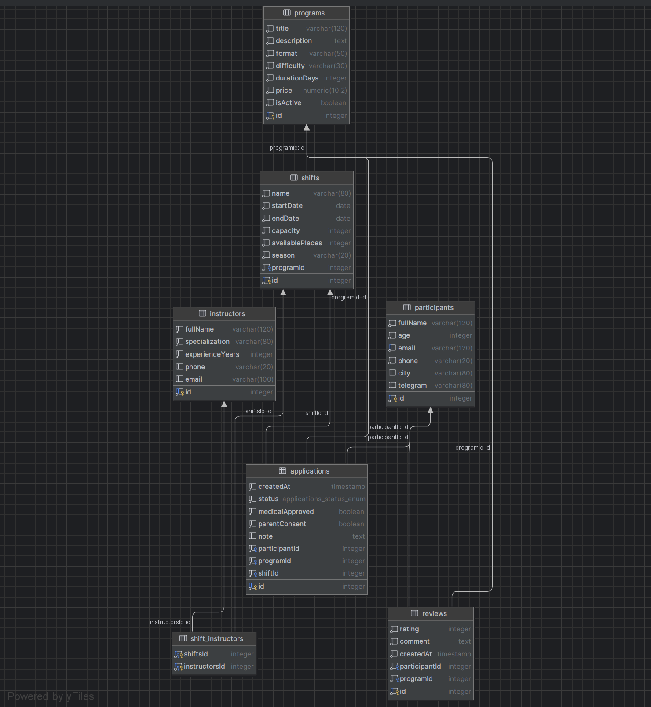

# Описание предметной области

Проект моделирует систему управления спортивно-туристическими программами «Send Him to Dagestan».
Система хранит информацию о доступных программах, конкретных сменах, инструкторах, участниках, заявках и отзывах.

# Сущности
### 1. Program

Описывает программу лагеря: название, формат, уровень сложности, длительность и стоимость.

### 2. Shift

Описывает конкретную смену внутри программы: даты проведения, сезон, вместимость и число свободных мест.

### 3. Instructor

Описывает инструктора, который может быть привязан к одной или нескольким сменам.

### 4. Participant

Описывает участника программы: ФИО, возраст, контакты, город и Telegram.

### 5. Application

Описывает заявку участника на выбранную программу и смену.
Содержит статус, отметки о меддопуске и согласии родителей.

### 6. Review

Описывает отзыв участника о программе.
Содержит оценку, текст комментария и дату публикации.

Связи между сущностями

одна Program имеет много Shift

одна Program имеет много Application

одна Program имеет много Review

одна Shift имеет много Application

одна Shift связана со многими Instructor

один Participant имеет много Application

один Participant имеет много Review

